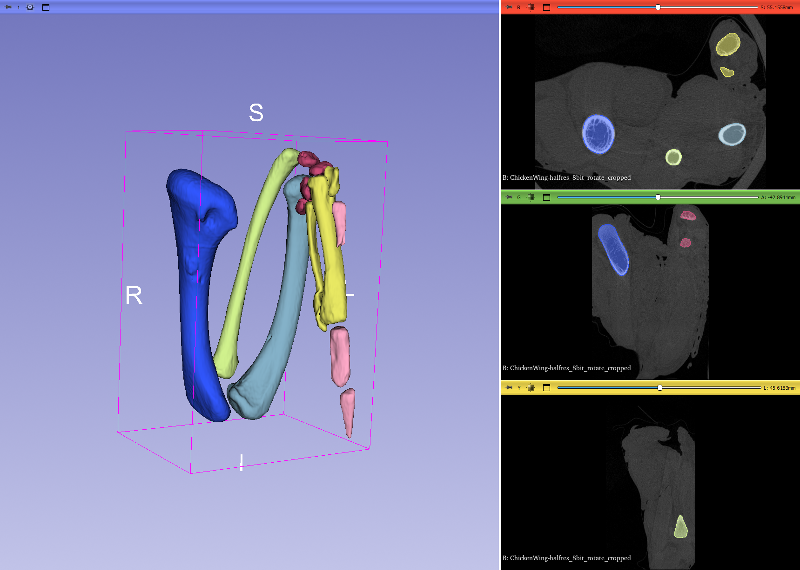

## MorphoDepot Repository
Repository for segmentation of a specimen scan.  See [this JSON file](MorphoDepotAccession.json) for specimen details.
* Species: Gallus gallus
* Modality: Micro CT (or synchrotron)
* Contrast: No
* Dimensions: (556, 423, 416)
* Spacing (mm): (0.1098, 0.1098, 0.2196)

## Screenshots

_Chicken forelimb specimen with included segmentation of skeletatal elements._
